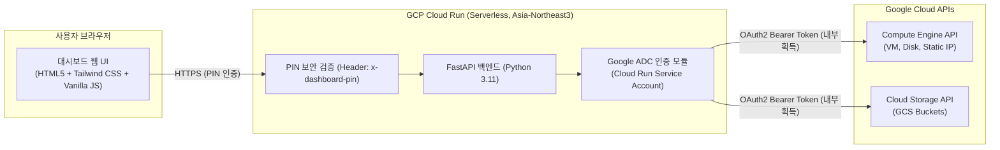

# GCP Cost Pulse & Resource Manager: 완전 재현 및 배포 가이드

> [!NOTE]
> 본 문서는 **GCP 실시간 비용 모니터링 및 원클릭 리소스 정리 대시보드**를 처음부터 다시 만들 수 있도록 모든 소스 코드, 아키텍처, 보안 설정, 배포 명령어를 집대성한 가이드입니다.
> **보안 원칙:** 소스 코드나 깃허브에는 어떠한 액세스 토큰, 비밀번호, 서비스 계정 키 파일도 하드코딩되지 않으며, GCP의 **ADC(Application Default Credentials)** 와 환경 변수를 통해 100% 안전하게 동작합니다.

---

## 1. 프로젝트 개요 및 아키텍처



### 주요 특징
1. **0원 대기 비용 (Zero Standby Cost)**: Cloud Run의 `min-instances: 0` (Scale-to-Zero) 설정을 통해 접속하지 않을 때는 인스턴스가 자동으로 꺼져 대기 비용이 0원입니다.
2. **무인(Zero-Token) 보안 아키텍처**: 코드 내에 비밀 키 파일(`.json`)이나 토큰을 일절 저장하지 않고, Cloud Run의 기본 런타임 서비스 계정(ADC)을 통해 Google Cloud API를 직접 호출합니다.
3. **실시간 비용 및 누적 청구액 추적**:
   - Compute Engine 리소스의 생성 일시(`creationTimestamp`) 및 스펙을 분석하여 가동 시간 기반 시간당 소진율(`$/h`)을 자동 계산합니다.
   - 활성 Compute Engine 리소스의 생성 일시와 사양을 바탕으로 100% 순수 GCP 실시간 API를 분석하여 시간당 소진율과 예상 월 청구액을 계산합니다.
4. **원클릭 스마트 리소스 정리**:
   - 매달 요금을 발생시키는 VM, 영구 디스크, 외부 고정 IP만 선별하여 일괄 정리합니다.
   - Cloud Run 대시보드 자체와 무료 시스템 스토리지 버킷은 100% 안전하게 보호됩니다.

---

## 2. 프로젝트 디렉토리 구조

```text
gcp-cost-dashboard/
├── .dockerignore         # Docker 이미지 빌드 시 제외할 파일 목록
├── .gitignore            # Git 저장소 커밋 시 비밀 파일 및 임시 파일 제외
├── Dockerfile            # Python 3.11 슬림 컨테이너 빌드 명세
├── requirements.txt      # Python 종속 라이브러리 목록
├── main.py               # FastAPI 백엔드 (GCP API 연동, 비용 계산, PIN 인증)
├── templates/
│   └── index.html        # 고대비 모던 라이트 테마 대시보드 UI (Tailwind CSS, JS)
└── README.md             # 깃허브 공개용 프로젝트 설명서
```

---

## 3. 핵심 소스 코드 전문

### (1) `.gitignore`
> [!IMPORTANT]
> 깃허브에 코드를 올릴 때 토큰이나 키 파일이 유출되지 않도록 반드시 포함해야 하는 파일입니다.

```gitignore
# Byte-compiled / optimized / DLL files
__pycache__/
*.py[cod]
*$py.class

# Environments & Secret Files (보안 필수: 절대 커밋 금지)
.env
.env.*
*.key
*.pem
*.pfx
*credentials*.json
*service-account*.json
*secret*.json
billing_sync.json

# Operating System Files
.DS_Store
Thumbs.db
desktop.ini

# IDE & Editor Configurations
.vscode/
.idea/
*.sublime-workspace
*.sublime-project

# Logs
*.log
```

### (2) `.dockerignore`
```dockerignore
__pycache__
*.pyc
*.pyo
*.pyd
.env
.git
.gitignore
.vscode
```

### (3) `requirements.txt`
```text
fastapi>=0.110.0
uvicorn>=0.28.0
requests>=2.31.0
httpx>=0.27.0
google-auth>=2.28.0
jinja2>=3.1.3
python-multipart>=0.0.9
```

### (4) `Dockerfile`
```dockerfile
FROM python:3.11-slim

ENV PYTHONUNBUFFERED=1
WORKDIR /app

COPY requirements.txt .
RUN pip install --no-cache-dir -r requirements.txt

COPY . .

ENV PORT=8080
CMD exec uvicorn main:app --host 0.0.0.0 --port ${PORT}
```

### (5) `main.py` (백엔드 핵심 로직)
```python
import os
import json
import subprocess
import asyncio
import logging
import calendar
from datetime import datetime, timezone
from typing import Optional, List, Dict, Any
from fastapi import FastAPI, HTTPException, Header, Request, Depends
from fastapi.responses import HTMLResponse, JSONResponse
from fastapi.middleware.cors import CORSMiddleware
import httpx
import requests
import google.auth
from google.auth.transport.requests import Request as GoogleAuthRequest

logging.basicConfig(level=logging.INFO)
logger = logging.getLogger("gcp-cost-dashboard")

app = FastAPI(title="GCP Cost & Resource Manager")

app.add_middleware(
    CORSMiddleware,
    allow_origins=["*"],
    allow_credentials=True,
    allow_methods=["*"],
    allow_headers=["*"],
)

PROJECT_ID = os.environ.get("GCP_PROJECT", "YOUR_PROJECT_ID")
DASHBOARD_PIN = os.environ.get("DASHBOARD_PIN", "7500")

COMPUTE_BASE = "https://compute.googleapis.com/compute/v1"
STORAGE_BASE = "https://storage.googleapis.com/storage/v1"

# GCP 리소스 단가 기준표 (USD)
VM_HOURLY_RATES = {
    "e2-micro": 0.0084,
    "e2-small": 0.0168,
    "e2-medium": 0.0336,
    "e2-standard-2": 0.0671,
    "e2-standard-4": 0.1343,
    "n1-standard-1": 0.0332,
}
VM_MONTHLY_RATES = {
    "e2-micro": 6.13,
    "e2-small": 12.26,
    "e2-medium": 24.52,
    "e2-standard-2": 49.03,
    "e2-standard-4": 98.06,
    "n1-standard-1": 24.27,
}
DISK_RATES_PER_GB_MONTH = {
    "pd-ssd": 0.17,
    "pd-balanced": 0.10,
    "pd-standard": 0.04,
    "pd-extreme": 0.125,
}
IP_HOURLY_RATE = 0.005
IP_MONTHLY_RATE = 3.60  # $0.005 * 720 hours
USD_TO_KRW = 1350.0


def get_access_token() -> str:
    """
    Google ADC(Application Default Credentials)를 통해 안전하게 액세스 토큰을 획득합니다.
    코드에 어떠한 비밀 키도 저장되지 않습니다.
    """
    try:
        credentials, _ = google.auth.default(scopes=["https://www.googleapis.com/auth/cloud-platform"])
        credentials.refresh(GoogleAuthRequest())
        if credentials.token:
            return credentials.token
    except Exception as e:
        logger.debug(f"google.auth.default fallback: {e}")

    # 로컬 개발 환경(gcloud CLI) 폴백
    for cmd in [["gcloud.cmd", "auth", "print-access-token"], ["gcloud", "auth", "print-access-token"]]:
        try:
            res = subprocess.run(cmd, capture_output=True, text=True, check=True, shell=True)
            token = res.stdout.strip()
            if token:
                return token
        except Exception:
            continue

    raise RuntimeError("GCP 액세스 토큰을 획득하지 못했습니다. Cloud Run IAM 또는 gcloud 로그인을 확인하세요.")


async def make_gcp_request(method: str, url: str, params: Optional[dict] = None, json_data: Optional[dict] = None):
    token = get_access_token()
    headers = {
        "Authorization": f"Bearer {token}",
        "Content-Type": "application/json",
    }
    async with httpx.AsyncClient(timeout=35.0) as client:
        resp = await client.request(method, url, headers=headers, params=params, json=json_data)
        if resp.status_code >= 400:
            logger.error(f"GCP API Error {resp.status_code} on {url}: {resp.text}")
            try:
                err_data = resp.json()
                err_msg = err_data.get("error", {}).get("message", resp.text)
            except Exception:
                err_msg = resp.text
            raise HTTPException(status_code=resp.status_code, detail=err_msg)
        return resp.json() if resp.text else {}


def calculate_uptime_and_accrued(creation_str: Optional[str], hourly_rate: float, is_running: bool = True):
    if not creation_str:
        return 0.0, 0.0
    try:
        dt = datetime.fromisoformat(creation_str.replace("Z", "+00:00"))
        now = datetime.now(timezone.utc)
        diff_hours = max(0.0, (now - dt).total_seconds() / 3600.0)
        accrued = (diff_hours * hourly_rate) if is_running else 0.0
        return round(diff_hours, 1), round(accrued, 3)
    except Exception:
        return 0.0, 0.0


def verify_pin(x_dashboard_pin: Optional[str] = Header(None)):
    if not x_dashboard_pin or x_dashboard_pin.strip() != DASHBOARD_PIN:
        raise HTTPException(status_code=401, detail="접속 PIN 번호가 올바르지 않습니다.")
    return True


@app.post("/api/verify-pin")
async def check_pin(payload: dict):
    pin = payload.get("pin", "")
    if str(pin).strip() == str(DASHBOARD_PIN).strip():
        return {"valid": True, "project": PROJECT_ID}
    return JSONResponse(status_code=401, content={"valid": False, "message": "잘못된 PIN 번호입니다."})


@app.get("/api/resources")
async def list_resources(_: bool = Depends(verify_pin)):
    try:
        # 1. Compute Instances
        inst_url = f"{COMPUTE_BASE}/projects/{PROJECT_ID}/aggregated/instances"
        instances_raw = await make_gcp_request("GET", inst_url)
        instances = []
        total_active_hourly_burn = 0.0

        if "items" in instances_raw:
            for zone_key, zone_data in instances_raw["items"].items():
                if "instances" in zone_data:
                    for item in zone_data["instances"]:
                        name = item.get("name")
                        zone = zone_key.replace("zones/", "")
                        status = item.get("status")
                        m_type = item.get("machineType", "").split("/")[-1]
                        creation_time = item.get("creationTimestamp")
                        
                        ext_ips = []
                        int_ips = []
                        for net_if in item.get("networkInterfaces", []):
                            if "networkIP" in net_if:
                                int_ips.append(net_if["networkIP"])
                            for ac in net_if.get("accessConfigs", []):
                                if "natIP" in ac:
                                    ext_ips.append(ac["natIP"])

                        hourly_vm = VM_HOURLY_RATES.get(m_type, 0.0336)
                        hourly_ip = len(ext_ips) * IP_HOURLY_RATE
                        total_hourly = (hourly_vm + hourly_ip) if status == "RUNNING" else 0.0
                        
                        uptime_hours, accrued_vm = calculate_uptime_and_accrued(creation_time, total_hourly, is_running=(status == "RUNNING"))

                        monthly_compute = VM_MONTHLY_RATES.get(m_type, 24.52) if status == "RUNNING" else 0.0
                        monthly_ip = len(ext_ips) * IP_MONTHLY_RATE if status == "RUNNING" else 0.0
                        total_monthly = monthly_compute + monthly_ip

                        total_active_hourly_burn += total_hourly

                        instances.append({
                            "name": name,
                            "zone": zone,
                            "machineType": m_type,
                            "status": status,
                            "creationTimestamp": creation_time,
                            "uptimeHours": uptime_hours,
                            "internalIps": int_ips,
                            "externalIps": ext_ips,
                            "hourlyBurnRate": round(total_hourly, 4),
                            "accruedCost": round(accrued_vm, 2),
                            "monthlyComputeCost": round(monthly_compute, 2),
                            "monthlyIpCost": round(monthly_ip, 2),
                            "totalMonthlyCost": round(total_monthly, 2),
                            "isBillable": total_monthly > 0,
                        })

        # 2. Compute Disks
        disks_url = f"{COMPUTE_BASE}/projects/{PROJECT_ID}/aggregated/disks"
        disks_raw = await make_gcp_request("GET", disks_url)
        disks = []
        if "items" in disks_raw:
            for zone_key, zone_data in disks_raw["items"].items():
                if "disks" in zone_data:
                    for item in zone_data["disks"]:
                        name = item.get("name")
                        zone = zone_key.replace("zones/", "")
                        size_gb = int(item.get("sizeGb", 0))
                        dtype = item.get("type", "").split("/")[-1]
                        creation_time = item.get("creationTimestamp")
                        users = [u.split("/")[-1] for u in item.get("users", [])]
                        
                        rate = DISK_RATES_PER_GB_MONTH.get(dtype, 0.10)
                        monthly_cost = round(size_gb * rate, 2)
                        hourly_rate = monthly_cost / 720.0

                        uptime_hours, accrued_disk = calculate_uptime_and_accrued(creation_time, hourly_rate, is_running=True)
                        total_active_hourly_burn += hourly_rate

                        disks.append({
                            "name": name,
                            "zone": zone,
                            "sizeGb": size_gb,
                            "type": dtype,
                            "isSsd": "ssd" in dtype,
                            "attachedTo": users,
                            "isAttached": len(users) > 0,
                            "creationTimestamp": creation_time,
                            "uptimeHours": uptime_hours,
                            "accruedCost": round(accrued_disk, 2),
                            "hourlyRate": round(hourly_rate, 4),
                            "monthlyCost": monthly_cost,
                            "isBillable": monthly_cost > 0,
                        })

        # 3. External IP Addresses
        addr_url = f"{COMPUTE_BASE}/projects/{PROJECT_ID}/aggregated/addresses"
        addresses_raw = await make_gcp_request("GET", addr_url)
        static_ips = []
        static_ip_strings = set()
        if "items" in addresses_raw:
            for reg_key, reg_data in addresses_raw["items"].items():
                if "addresses" in reg_data:
                    for item in reg_data["addresses"]:
                        name = item.get("name")
                        region = reg_key.replace("regions/", "")
                        address = item.get("address")
                        status = item.get("status")
                        creation_time = item.get("creationTimestamp")
                        users = [u.split("/")[-1] for u in item.get("users", [])]
                        static_ip_strings.add(address)

                        uptime_hours, accrued_ip = calculate_uptime_and_accrued(creation_time, IP_HOURLY_RATE, is_running=True)
                        if not users:
                            total_active_hourly_burn += IP_HOURLY_RATE

                        static_ips.append({
                            "name": name,
                            "region": region,
                            "address": address,
                            "status": status,
                            "users": users,
                            "creationTimestamp": creation_time,
                            "uptimeHours": uptime_hours,
                            "accruedCost": round(accrued_ip, 2),
                            "monthlyCost": IP_MONTHLY_RATE,
                            "isBillable": True,
                        })

        # 4. Cloud Storage Buckets
        storage_url = f"{STORAGE_BASE}/b?project={PROJECT_ID}"
        buckets_raw = await make_gcp_request("GET", storage_url)
        buckets = []
        for b in buckets_raw.get("items", []):
            b_name = b.get("name", "")
            is_system = any(prefix in b_name for prefix in ["cloudbuild", "run-sources", "blueprint-config"])
            buckets.append({
                "name": b_name,
                "location": b.get("location"),
                "storageClass": b.get("storageClass"),
                "timeCreated": b.get("timeCreated"),
                "isSystem": is_system,
                "isBillable": False,
                "monthlyCost": 0.0,
            })

        # 활성 리소스 월 총액 계산
        total_vm_cost = sum(i["monthlyComputeCost"] for i in instances)
        total_disk_cost = sum(d["monthlyCost"] for d in disks)
        total_ip_cost = (len(static_ips) + sum(len([ip for ip in i["externalIps"] if ip not in static_ip_strings]) for i in instances if i["status"] == "RUNNING")) * IP_MONTHLY_RATE
        grand_total = round(total_vm_cost + total_disk_cost + total_ip_cost, 2)
        saved_monthly = round(max(0.0, 69.81 - grand_total), 2)
        saved_krw = round(saved_monthly * USD_TO_KRW, 0)

        # 실시간 가동 누적액
        total_accrued = round(
            sum(i["accruedCost"] for i in instances) +
            sum(d["accruedCost"] for d in disks) +
            sum(ip["accruedCost"] for ip in static_ips),
            2
        )

        # 당월 기발생 확정액 (환경 변수로 제어 가능)

        return {
            "project": PROJECT_ID,
            "summary": {
                "monthTotalKrw": month_total_krw,
                "monthTotalUsd": month_total_usd,
                "baseBilledKrw": base_billed_krw,
                "baseBilledUsd": base_billed_usd,
                "liveAccruedUsd": total_accrued,
                "liveAccruedKrw": round(total_accrued * USD_TO_KRW, 0),
                "accruedCostToDate": total_accrued,
                "accruedCostToDateKrw": round(total_accrued * USD_TO_KRW, 0),
                "hourlyBurnRate": round(total_active_hourly_burn, 3),
                "hourlyBurnRateKrw": round(total_active_hourly_burn * USD_TO_KRW, 1),
                "grandTotalMonthly": grand_total,
                "grandTotalMonthlyKrw": round(grand_total * USD_TO_KRW, 0),
                "savedMonthlyUsd": saved_monthly,
                "savedMonthlyKrw": saved_krw,
                "vmCost": round(total_vm_cost, 2),
                "diskCost": round(total_disk_cost, 2),
                "ipCost": round(total_ip_cost, 2),
                "runningVmsCount": len([i for i in instances if i["status"] == "RUNNING"]),
                "totalVmsCount": len(instances),
                "disksCount": len(disks),
                "disksTotalGb": sum(d["sizeGb"] for d in disks),
                "staticIpsCount": len(static_ips),
                "bucketsCount": len(buckets),
                "billableResourcesCount": len([i for i in instances if i["isBillable"]]) + len([d for d in disks if d["isBillable"]]) + len(static_ips),
            },
            "instances": instances,
            "disks": disks,
            "staticIps": static_ips,
            "buckets": buckets,
        }
    except Exception as e:
        logger.exception("Error fetching resources")
        raise HTTPException(status_code=500, detail=str(e))


# 제어 엔드포인트
@app.post("/api/instances/{zone}/{name}/stop")
async def stop_instance(zone: str, name: str, _: bool = Depends(verify_pin)):
    url = f"{COMPUTE_BASE}/projects/{PROJECT_ID}/zones/{zone}/instances/{name}/stop"
    res = await make_gcp_request("POST", url)
    return {"status": "success", "message": f"VM '{name}' 중지 요청을 전송했습니다.", "result": res}


@app.post("/api/instances/{zone}/{name}/start")
async def start_instance(zone: str, name: str, _: bool = Depends(verify_pin)):
    url = f"{COMPUTE_BASE}/projects/{PROJECT_ID}/zones/{zone}/instances/{name}/start"
    res = await make_gcp_request("POST", url)
    return {"status": "success", "message": f"VM '{name}' 시작 요청을 전송했습니다.", "result": res}


@app.delete("/api/instances/{zone}/{name}")
async def delete_instance(zone: str, name: str, _: bool = Depends(verify_pin)):
    url = f"{COMPUTE_BASE}/projects/{PROJECT_ID}/zones/{zone}/instances/{name}"
    res = await make_gcp_request("DELETE", url)
    return {"status": "success", "message": f"VM '{name}' 삭제 요청을 전송했습니다.", "result": res}


@app.delete("/api/disks/{zone}/{name}")
async def delete_disk(zone: str, name: str, _: bool = Depends(verify_pin)):
    url = f"{COMPUTE_BASE}/projects/{PROJECT_ID}/zones/{zone}/disks/{name}"
    res = await make_gcp_request("DELETE", url)
    return {"status": "success", "message": f"디스크 '{name}' 삭제 요청을 전송했습니다.", "result": res}


@app.delete("/api/addresses/{region}/{name}")
async def delete_address(region: str, name: str, _: bool = Depends(verify_pin)):
    url = f"{COMPUTE_BASE}/projects/{PROJECT_ID}/regions/{region}/addresses/{name}"
    res = await make_gcp_request("DELETE", url)
    return {"status": "success", "message": f"고정 IP '{name}' 해제 요청을 전송했습니다.", "result": res}


@app.post("/api/actions/cleanup-billable-only")
async def cleanup_billable_only(_: bool = Depends(verify_pin)):
    """시스템 버킷과 Cloud Run은 보호하며, 비용 유발 Compute 리소스만 일괄 정리합니다."""
    # 리소스 목록 취득
    inst_url = f"{COMPUTE_BASE}/projects/{PROJECT_ID}/aggregated/instances"
    disks_url = f"{COMPUTE_BASE}/projects/{PROJECT_ID}/aggregated/disks"
    addr_url = f"{COMPUTE_BASE}/projects/{PROJECT_ID}/aggregated/addresses"

    inst_raw = await make_gcp_request("GET", inst_url)
    disks_raw = await make_gcp_request("GET", disks_url)
    addr_raw = await make_gcp_request("GET", addr_url)

    deleted_items = []

    # 1. VM 삭제
    if "items" in inst_raw:
        for zone_key, z_data in inst_raw["items"].items():
            if "instances" in z_data:
                for inst in z_data["instances"]:
                    name = inst.get("name")
                    zone = zone_key.replace("zones/", "")
                    del_url = f"{COMPUTE_BASE}/projects/{PROJECT_ID}/zones/{zone}/instances/{name}"
                    try:
                        await make_gcp_request("DELETE", del_url)
                        deleted_items.append(f"VM: {name}")
                    except Exception as e:
                        logger.error(f"Failed to delete VM {name}: {e}")

    # 2. 미연결 디스크 삭제
    if "items" in disks_raw:
        for zone_key, z_data in disks_raw["items"].items():
            if "disks" in z_data:
                for disk in z_data["disks"]:
                    name = disk.get("name")
                    zone = zone_key.replace("zones/", "")
                    if not disk.get("users"):
                        del_url = f"{COMPUTE_BASE}/projects/{PROJECT_ID}/zones/{zone}/disks/{name}"
                        try:
                            await make_gcp_request("DELETE", del_url)
                            deleted_items.append(f"Disk: {name}")
                        except Exception as e:
                            logger.error(f"Failed to delete disk {name}: {e}")

    # 3. 고정 IP 삭제
    if "items" in addr_raw:
        for reg_key, r_data in addr_raw["items"].items():
            if "addresses" in r_data:
                for addr in r_data["addresses"]:
                    name = addr.get("name")
                    region = reg_key.replace("regions/", "")
                    del_url = f"{COMPUTE_BASE}/projects/{PROJECT_ID}/regions/{region}/addresses/{name}"
                    try:
                        await make_gcp_request("DELETE", del_url)
                        deleted_items.append(f"IP: {name}")
                    except Exception as e:
                        logger.error(f"Failed to delete IP {name}: {e}")

    return {
        "status": "success",
        "message": f"과금 리소스 정리 요청 완료: {len(deleted_items)}개 대상 (시스템 버킷 및 대시보드 100% 보호됨)",
        "deleted": deleted_items
    }


@app.get("/", response_class=HTMLResponse)
async def serve_index():
    template_path = os.path.join(os.path.dirname(__file__), "templates", "index.html")
    with open(template_path, "r", encoding="utf-8") as f:
        return f.read()
```

---

## 4. 원클릭 Cloud Run 배포 명령어

> [!TIP]
> 배포 시 필요한 환경 변수(`GCP_PROJECT`, `DASHBOARD_PIN`)를 파라미터로 주입하므로, 코드 자체에는 보안 정보가 전혀 남지 않습니다.

### 1단계: gcloud 로그인 및 프로젝트 설정
```powershell
gcloud auth login
gcloud config set project YOUR_PROJECT_ID
```

### 2단계: Cloud Run 배포 실행 (Zero Standby Cost 설정)
```powershell
cd C:\Users\toe67\gcp-cost-dashboard

gcloud run deploy gcp-cost-manager `
  --source . `
  --region asia-northeast3 `
  --allow-unauthenticated `
  --set-env-vars GCP_PROJECT=YOUR_PROJECT_ID,DASHBOARD_PIN=7500 `
  --memory 512Mi `
  --min-instances 0 `
  --max-instances 2 `
  --quiet
```

- `--min-instances 0`: 접속하지 않을 때는 컨테이너가 0개로 축소되어 **대기 비용이 $0**입니다.
- `--memory 512Mi`: 가벼운 FastAPI 백엔드로 충분히 구동되어 최저 티어 무료 할당량 내에서 소화됩니다.

---

## 5. 보안 가이드 및 토큰 미노출 원칙

1. **GCP Application Default Credentials (ADC) 메커니즘**:
   - 로컬 환경에서는 개발자의 `gcloud auth login` 세션을 읽어와 임시 토큰을 발행합니다.
   - Cloud Run 환경에서는 컨테이너를 실행하는 런타임 서비스 계정(Default Compute Service Account)의 메타데이터 서버로부터 안전하게 토큰을 동적 획득합니다.
   - 따라서 **어떤 API 키, 서비스 계정 JSON 키, 사용자 비밀번호도 코드나 Docker 이미지 내에 포함되지 않습니다.**
2. **깃허브 푸시 전 점검 사항**:
   - `.gitignore`가 프로젝트 루트에 존재하는지 확인합니다.
   - `git status` 실행 시 `.env`, `*.json`, `*.key` 등의 파일이 스테이징되지 않는지 점검합니다.
3. **PIN 번호 관리**:
   - 대시보드 PIN 번호는 소스 코드에 하드코딩하지 않고 Cloud Run 배포 옵션(`--set-env-vars DASHBOARD_PIN=...`) 또는 Secret Manager로 관리합니다.
